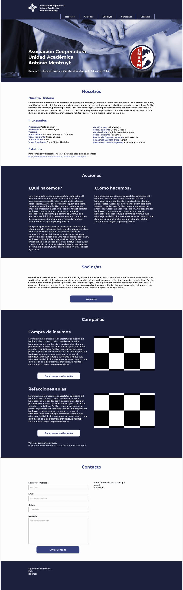
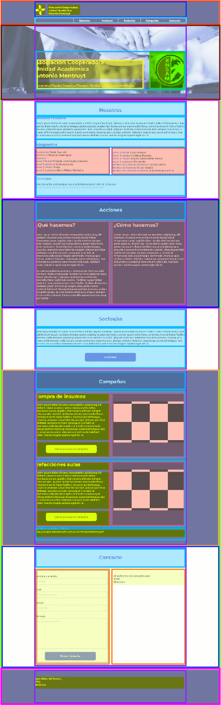

# Proyecto web la ASOCIACIÓN COOPERADORA UNIDAD ACADÉMICA ANTONIO MENTRUYT

Hemos elegido concretar el proyecto de la página web para la asociación cooperadora escolar, ya que nos resulta altruista. Tenemos la convicción de que la educación pública debe reivindicarse, y en este proceso las cooperadoras escolares tienen un papel clave.

## Tabla de Contenidos

- [Proceso](#proceso)
- [Características](#características)
- [Licencia](#licencia)

## Proceso

En primer lugar se han evaluado las necesidades comunicacionales de la Cooperadora, relevando las areas que debian cubrirse. Con esta informacion se bosquejo en Figma una propuesta de diseño:
`https://www.figma.com/proto/Ujee7RAaxVqnUbXyDa7Cmu/cooperadoraensam?type=design&node-id=6-55&scaling=min-zoom&page-id=3%3A13&starting-point-node-id=6%3A55`

A este diseño se le analizarón las clases y secciones, separando y pensando como seria su maquetación web:

## Características

- Se contempló el diseño "One Page" con secciones para navegar
- Se usaron tipografías de Google Fonts
- Se incorporarón Íconos de Flaticon
- Se animaron botones
- Se le otorgó funcionalidad a algunos botones con JavaScript
- Se incluyó un Formulario de contacto con validación en JavaScript y un envio post validación de un reCAPTCHA (que no es funcional dado que aún no se pudo comprar el dominio pretendido por ser .org.ar y llevar más tiempo de analisis para que sea brindado por nic.ar) abriendo un aviso de envio exitoso ó fallido según los pasos dados, utilizanco php para el envio del correo. 
- El diseño es totalmente responsive en tres cotas minimas
- Se incorporó un iframe de googlemaps
- Como api tomamos el uso del recaptcha en el formulario

## Licencia

Este proyecto está bajo la [Licencia MIT](LICENSE).
